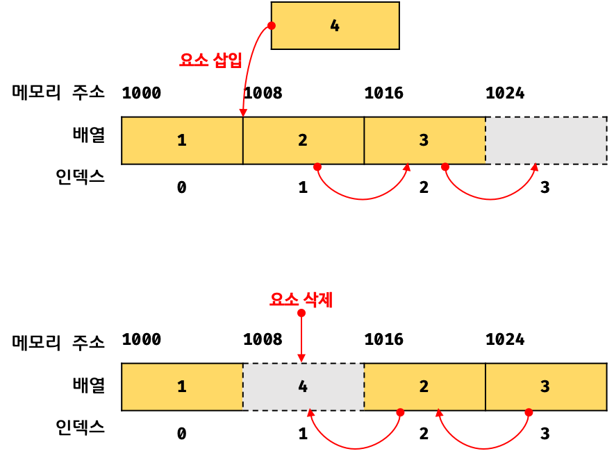
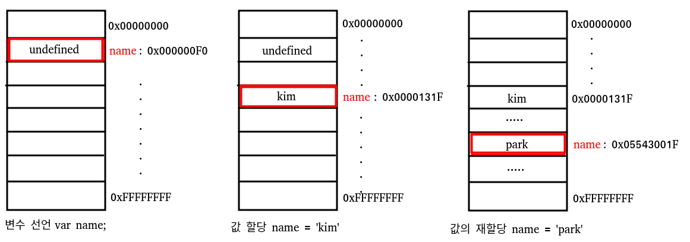
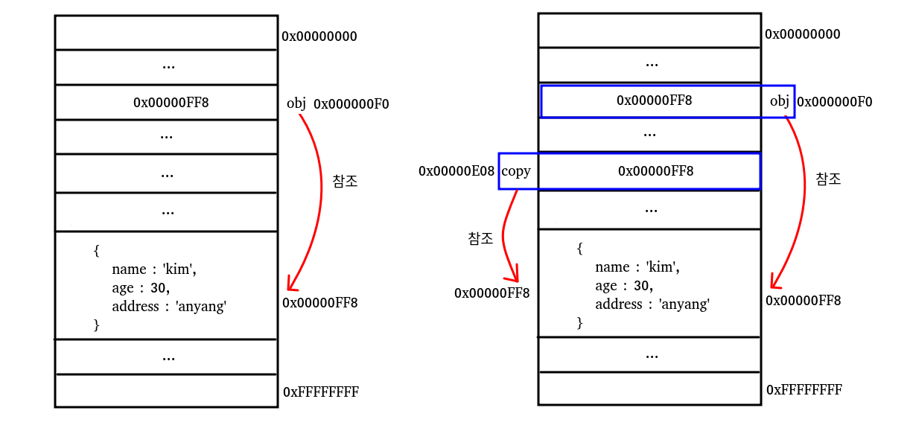

# 배열과 튜플

키워드

- 선언형과 함수형 프로그래밍
- 순수함수
- 배열과 튜플

## 05-1 배열 이해하기

### [] 단축구문 (배열리터럴: deepdive 500p )

```js
const numbers = [1, 2, 3];
const strings = ["hello", "world"];
```

### 자바스크립트에서 배열은 객체다 (배열은 Array 클래스의 인스턴스)

자바스크립트의 배열은 엄밀히 말해 일반적 의미의 배열이 아니다.  
자바스크립트의 배열은 일반적인 배열의 동작을 흉내낸 특수한 객체이다. (유사배열 객체)

<details>
  <summary summary style="font-size: 1.17em; font-weight: bold;">배열과 유사배열</summary>

자바스크립트 배열은 인덱스를 프로퍼티 키로 가지며 length 프로퍼티를 갖는 특수한 객체이다.  
자바스크립트 배열의 요소는 사실 프로퍼티 값이다.


사진 출처: https://inpa.tistory.com/entry/JS-📚-Array-메소드-✏️-정리 [Inpa Dev 👨‍💻:티스토리]

```js
const arr2 = Array.from({ length: 2, 0: "a", 1: "b" });
console.log(arr2); // [ 'a', 'b' ]
```

#### 1. 유사 배열 객체의 조건:

숫자 형태의 인덱스를 프로퍼티 키로 가짐
length 프로퍼티를 가짐

```js
const arrayLike = {
  0: "apple",
  1: "banana",
  2: "orange",
  length: 3,
};
```

#### 2. 유사 배열 객체와 배열

이 객체는 array로 변환할 수 있음

- 유사배열 객체 - 배열 - 유사배열객체

```js
//유사배열 객체 -> 배열
const arrayLike = {
  0: "apple",
  1: "banana",
  2: "orange",
  length: 3,
};
const realArray = Array.from(arrayLike);
console.log(realArray);
console.log(Array.isArray(realArray)); //true

//배열 -> 유사배열 객체

const toArrayLike = Object.assign({ length: realArray.length }, realArray);
console.log(toArrayLike); //{0: 'apple', 1: 'banana', 2: 'orange', length: 3}
console.log(Array.isArray(toArrayLike)); //false
```

</details>

### 배열의 타입

```ts
//아이템 타입[]

const numArray: number[] = [1, 2, 3];
const strArray: string[] = ["a", "b", "c"];

interface IPerson {
  name: string;
  age?: number;
}
const personArray: IPerson[] = [{ name: "Jack", age: 23 }, { name: "Jane" }];
```

### 문자열과 배열 간 변환

JS는 문자열은 변경할 수 없으므로 가공하려면 split 메서드를 사용하여 배열로 전환해야함

```
String.prototype.split(나눌문자열, [한계 갯수])
```

```js
const str = "The quick brown fox jumps over the lazy dog.";

const words = str.split(" ");
console.log(words[3]);
// Expected output: "fox"

const chars = str.split("");
console.log(chars[8]);
// Expected output: "k"

const strCopy = str.split();
console.log(strCopy);
// Expected output: Array ["The quick brown fox jumps over the lazy dog."]
```

다시 string으로 변환하려면 join을 사용

```
Array.prototype.join([구분문자열])
```

```js
const elements = ["Fire", "Air", "Water"];

console.log(elements.join());
// Expected output: "Fire,Air,Water"

console.log(elements.join(""));
// Expected output: "FireAirWater"

console.log(elements.join("-"));
// Expected output: "Fire-Air-Water"
```

### 인덱스 연산자

특정위치에 있는 아이템을 얻고자 하는 경우 인덱스 연산자를 사용

```
배열명[index]
```

### 배열의 비구조화 할당

배열에도 비구조화 할당 적용 가능

### for...in문

for ... in array하면 ...에는 키인 인덱스가, object면 ...에는 프로퍼티가 들어감

```js
const object = { a: 1, b: 2, c: 3 };

for (const property in object) {
  console.log(`${property}: ${object[property]}`);
}

// Expected output:
// "a: 1"
// "b: 2"
// "c: 3"
```

```js
const names = ["Jack", "Jane", "Steve"];
for (let index in names) {
  const name = names[index];
  console.log(`[${index}]: ${name}`);
}
//[0]: Jack
//[1]: Jane
//[2]: Steve
```

### 제네릭 방식 타입

타입을 변수형태로 사용하는 것을 제네릭 타입이라고 한다.  
제네릭 타입 함수 호출 시 타입을 지정해주면 된다.

```ts
export const arrayLength = <T>(array: T[]): number => array.length;
export const isEmpty = <T>(array: T[]): boolean => arrayLength<T>(array) === 0;

const numArray: number[] = [1, 2, 3];
const strArray: string[] = ["Hello", "World"];
const emptyArr = [];

console.log(arrayLength(numArray)); //3; //타입 자동 추론되므로 타입 설정하지 않아도 에러나지 않음
console.log(isEmpty([])); //true
```

### 제네릭 함수의 타입 추론

자동으로 타입이 추론되므로 타입 변수를 생략해도 가능

```
함수이름<타입 변수>(매개변수)
```

### 제네릭 함수의 함수 시그니처

```ts
const error = <T>(cb: (arg: T, i?: number) => number): void => {}; //에러
//JSX/TSX 와 구분할 수 있도록 아래와 같이 작성

const error = <T>(cb: (arg: T, i?: number) => number): void => {};
const error = <T extends unknown>(
  cb: (arg: T, i?: number) => number
): void => {};
```

### 전개 연산자

전개 연산자는 배열에도 적용 가능

```ts
const array1: number[] = [1];
const array2: number[] = [2, 3];

const mergedArray: number[] = [...array1, ...array2];
console.log(mergedArray);
```

### range함수 구현

```ts
export const range = (from: number, to: number): number[] =>
  from < to ? [from, ...range(from + 1, to)] : [];

range(1, 4); //[1, ...[2, ...[3, ...[]]]]
```

## 05-2 선언형 프로그래밍과 배열

명령형은 CPU 친화적 저수준 구현방식
선언형은 인간 친화적 고수준 구현방식

- 다른 설명
  - **명령형**은 순차적 지시 (how, recipe, 방법, 순서) **선언형**은 최종결과 설명 프로그래밍 (what) (참조 : Flab)
  - **명령형**은 코드가 어떻게 동작해야 하는지에 집중 **선언형**은 결과를 묘사, 원하는 데이터에 집중 (참조 : 위시캣)

### 명령형 프로그래밍이란?

#### 명령형 프로그래밍

```
- 입력 데이터 얻기
- 입력 데이터 가공해 출력 데이터 생성
- 출력 데이터 출력
```

여러개의 데이터를 대상으로 할 때 for문을 사용

#### 선언형 프로그래밍

시스템 자원의 효율적 운용보다는 일괄적 문제 해결 구조에 집중  
모든 데이터를 배열에 담고 다른 형태의 배열로 가공

```
- 문제를 푸는데 필요한 모든 데이터 배열에 저장
- 입력 데이터 배열을 가공해 출력 데이터 배열 생성
- 출력 데이터 배열에 담긴 아이템 출력
```

### fold: 데이터 배열 접기

폴드란 배열 데이터 가공해 하나의 값을 생성 하려고 할 때 사용됨

```ts
export const fold = <T>(
  array: T[],
  callback: (result: T, val: T) => T,
  initValue: T
) => {
  let result: T = initValue;
  for (let i = 0; i < array.length; ++i) {
    const value = array[i];
    result = callback(result, value);
  }

  return result;
};
```

<hr/>
<h4> 선언형 vs 명령형 프로그래밍</h4>
<hr/>

명령형 : 1부터 100까지 더하기

```ts imperative-sum.ts
let sum = 0;
for (let val = 1; val <= 100; ) {
  sum += val++;
}
console.log(sum); //5050
```

선언형 : 5050을 얻어내기

```ts declarative-sum.ts
import { range } from "./range";
import { fold } from "./fold";

const numbers: number[] = range(1, 100 + 1);

const result = fold(numbers, (result, value) => result + value, 0);
console.log(result);
```

```ts filter.ts
const filter = <T>(
  array: T[],
  callback: (value: T, index?: number) => boolean
): T[] => {
  let result: T[] = [];
  for (let index: number = 0; index < array.length; ++index) {
    const value = array[index];
    if (callback(value, index)) result = [...result, value];
  }
  return result;
};
```

```
...(생략)...
```

## 05-3 배열의 map, reduce, filter메서드

메서드 체인 방식으로 동작하도록 설계

## 05-4 순수함수와 배열

### 순수함수란?

부수효과가 없는 함수

```
- 몸통에 입출력 관련 코드가 없어야
- 함수 몸통에서 매개변수값을 변경시키지 않는다
- 함수는 몸통에서 만들어진 결과를 즉시 반환
- 함수 내부에 전역변수나 정적 변수를 사용하지 않음
- 함수가 예외를 발생시키지 않음
- 함수가 콜백함수로 구현되었거나 함수 몸통에 콜백함수를 사용하는 코드가 없다
- 함수 몸통에 Promise와같은 비동기 방식 동작 코드가 없다. (항상 같은 결과를 반환하지 않으므로)
```

#### impure 함수

```ts
function impure1(array:number[]):void {
  array.push(1) //매개변수 변경
  array.splice(0,1)
}

let g = 10;
function impure2(x: number) return x + g //외부변수 사용
```

### 타입 수정자 readonly

array타입을 readonly로 설정  
타입스크립트에서 인터페이스, 클래스, 함수의 매개변수는 let const키워드 없이 선언하므로  
const와 같은 효과를 주기 위해 readonly로 타입 수정

```ts
function forcePure(array: readonly number[]) {
  array.push(1); //❌ Error: Property 'push' does not exist on type 'readonly number[]'
}
```

### 불변과 가변

const나 readonly를 명시하면 초깃값을 항상 유지

```
const는 선언과 할당을 동시에,
let과 var는 선언 이후 할당 가능
```

### 깊은 복사와 얕은 복사

복사 : 어떤 변숫값을 다른 변숫값으로 설정하는 것

```ts
let original = 1;
let copied = original;
copied += 2;
console.log(original, copied); //1 3
```

다른 변숫값으로 복사된 값을 변경할 떄 원본값이 변경되지 않는다면 깊은 복사

객체와 배열은 얕은 복사 (참조에 의한 변경) - 주소 참조값을 복사

```ts
const originalArray = [5, 3, 9, 7];
const shallowCopiedArray = originalArray;
shallowCopiedArray[0] = 0;
console.log(originalArray, shallowCopiedArray); // [0, 3, 9, 7] [0, 3, 9, 7]
```

### 전개 연산자와 깊은 복사

주의 깊은 복사가 아니라 1차 얕은 복사임  
중첩 배열은 참조에 의한 변경으로 내부의 배열은 변경하지 않음

```ts
const oArray = [1, 2, 3, 4];
const deepCopiedArray = [...oArray];
deepCopiedArray[0] = 0;
console.log(oArray, deepCopiedArray); //[1, 2, 3, 4] [0, 2, 3, 4]
```




사진 출처 : https://velog.io/@tpgus758/%EC%9B%90%EC%8B%9C-%EA%B0%92%EA%B3%BC-%EA%B0%9D%EC%B2%B4

깊은 복사를 하려면 lodash의 deepCopy를 사용하거나  
JSON.parse(JSON.stringify(obj))를 사용 또는 재귀함수로 선언

### sort 메서드를 순수함수로 구현

```ts
export const pureSort = <T>(array: readonly T[]): T[] => {
  let deepCopied = [...array];
  return deepCopied.sort();
};
```

### 배열의 filter메서드와 순수한 삭제

splice는 원본 배열을 변경하므로  
배열속 특정 아이템을 삭제할 때는 filter메서드 적합

### 가변 인수 함수와 순수 함수

가변 인수 : 함수 호출시 인수의 개수를 제한하지 않는 것

mergeArray구현하기

```ts
const mergedArray1 = string[] = mergeArray([['Hello'], ['World']])
const mergedArray2 = number[] = mergeArray([[1], [2], [3, 4]])
```

인수를 여러개 받아도 모두 정상으로 merge되어 하나의 array를 return하는 mergeArray함수를 생성해야한다.

- type 설정

```ts
const mergeArray = <T>(...arrays: readonly T[][]): T[] => {};
```

중첩 배열일때도 하나의 배열이 return 되어야 함

```ts
const mergeArray = <T>(...arrays: readonly T[][]): T[] => {
  let result: T[] = [];
  for (let index = 0; index < arrays.length; index++) {
    const array: T[] = arrays[index];

    result = [...result, ...array];
  }
  return result;
};
```

let으로 선언하는 것은 좋지 않으므로 reduce를 사용해서 더 간단히 mergeArray를 선언해보자

```ts
const mergeArray2 = <T>(...arrays: readonly T[][]): T[] => {
  const result = arrays.reduce((acc, cur) => [...acc, ...cur], [] as T[]);
  return result;
};
```

## 05-5 튜플 이해하기

```ts
const tuple: [number, boolean] = [1, true];
```
