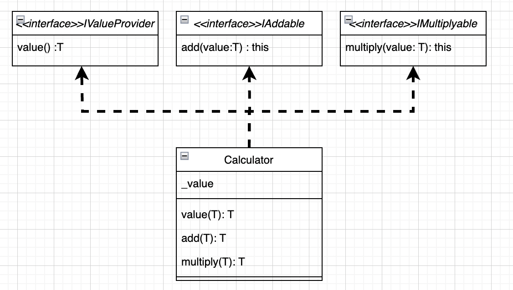

## 10장 제네릭 프로그래밍
### 다형성
>프로그램 언어의 다형성(polymorphism)은 그 프로그래밍 언어의 자료형 체계의 설징을 나타내는 것으로, **프로그램 언어의 각 요소들(상수, 변수, 식, 오브젝트, 함수, 메소드 등) 다양한 자료형에 속하는 것이 허가되는 성질을 가리킨다.** 반댓말은 단형성(monomorphism)으로 프로그램 언어의 각 요소가 한가지 형태만 가지는 성질을 가리킨다.
>[위키백과-다형성](https://ko.wikipedia.org/wiki/%EB%8B%A4%ED%98%95%EC%84%B1_(%EC%BB%B4%ED%93%A8%ED%84%B0_%EA%B3%BC%ED%95%99))
### 코드의 중복
```typescript
test('duplicateCode', ()=>{ 

    function printString(value: string): string {  
        console.log("value : ", value);  
        return value;  
    }  

    function printNumber(value: number): number {  
        console.log("value : ", value);  
        return value;  
    }  
  
    expect(printString("hello")).toBe("hello");  
    expect(printNumber(1)).toBe(1);  
});
```
* 파라미터의 타입이 추가되는 경우에 같은 로직의 코드라도 함수가 중복되어 만들어집니다.
* 만약 공통의 로직을 수정하는 일이 생긴다면 코드의 수정은 함수의 개수만큼 늘어납니다.
### any 타입 사용
```typescript
  test('any', ()=>{  
  
    function printAny(value: any): any {  
        console.log("value : ", value);  
        return value;  
    }  
  
    expect(printAny("hello")).toBe("hello");  
    expect(printAny(1)).toBe(1);  
});
```
* `any` 타입을 사용하면 타입 검사가 무력화되어 런타임 오류가 발생할 가능성이 높아집니다.
### 함수 오버로딩
* 동일한 함수 이름으로 여러 개의 함수 시그너처를 정의할 수 있는 기능입니다.
* 이를 통해 다양한 매개변수 타입과 반환 타입을 가진 함수를 구현할 수 있습니다.
* 실제의 함수 구현은 모든 오버로드 시그니처와 호환되어야 합니다.
```typescript
test('overload', () => {  

	// 시그니처 정의
    function print(value: string): string;  
    function print(value: number): number;  
        
	// 실제 함수 구현
    function print(value: any): any {  
        console.log("value : ", value);  
        return value;  
    }  
  
    expect(print("hello")).toBe("hello");  
    expect(print(1)).toBe(1);  
});
```
* 파라미터의 타입이 추가될 때마다 시그니처 또한 추가되야합니다.
### 제네릭 타입
* 제네릭은 타입을 변수화하여 사용할 수 있게 해줍니다.
* 해당 심벌의 타입을 미리 지정하지 않고 다양한 타입에 대응하려고 할 때 사용합니다.
```typescript
test('generic', () => {  

    function print<T>(value: T): T {  
        console.log("value : ", value);  
        return value;  
    }  
  
    expect(print("hello")).toBe("hello");  
    expect(print(1)).toBe(1);  
});
```
* 클래스
```typescript
class Valuable<T> {

	constructor(public value: T) {}
}
```
* 함수
```typescript
function identity<T>(arg: T): T {return arg}
```
* 타입 별칭
```typescript
type IValuable<T> = {

	value: T
}
```
##### 장점
* 컴파일 시점에 타입 체크를 수행하여 런타임 오류를 줄일 수 있습니다.
* 다양한 타입에 대해 동작하는 재사용 가능한 컴포넌트를 작성할 수 있습니다.
* 여러 데이터 타입에 대응할 수 있는 유연한 코드를 작성할 수 있습니다.
##### 단점
* 과도한 제네릭 타입의 사용은 코드의 복잡성을 높이고, 개발자가 이해하기 어렵게 할 수 있습니다.
---
### 제네릭 타입 제약
* `제네릭 타입 제약(Generic Constraints)`은 제네릭 타입 매개변수의 범위를 제한하는 기능입니다.
* 제네릭 타입 제약은 `extends`키워드를 사용하여 구현합니다. 이를 통해 제네릭 타입이 특정 인터페이스나 타입을 확장하도록 강제할 수 있습니다.
```typescript
test('generic_constraint', () => {  
    function printPrice<T extends { price: number }>(value: T): number {  
        console.log("price : ", value.price);  
        return value.price;  
    }  
  
    expect(printPrice({ productName: 'banana', price: 100 })).toBe(100);  
});
```

```typescript
test('generic_constraint', () => {  
    interface IValuable<Q> {  
        value: Q;  
    }  
  
    class Valuable<Q> implements IValuable<Q> {  
        constructor(public value: Q) {}  
    }  
  
    const printValueT = <Q, T extends IValuable<Q>>(o: T) =>{
	    console.log(o.value); 
	    return o.value; 
    }  
  
    expect(printValueT({ value: 1 })).toBe(1);  
    expect(printValueT(new Valuable(1))).toBe(1);  
      
    expect(printValueT({ value: 'hello' })).toBe('hello');  
    expect(printValueT(new Valuable('hello'))).toBe('hello');  
});
```
#### new 타입 제약
* **팩토리 함수**는 new 연산자를 사용해 객체를 생성하는 기능을 하는 함수를 의미합니다.
* `new 타입 제약`은 제네릭 타입 매개변수가 생성자를 가지고 있음을 보장하기 위해 사용됩니다.
* new 제약을 사용해 제네릭 타입이 new 키워드로 인스턴스화 될 수 있음을 보장합니다.
```typescript
// 1.
const create = <T extends {new(): T}>(type: T): T => new type()

// 2.
const create = <T>(type: new() => T): T => new type()
```
* 생성자에 매개변수를 전달해야 할 때는 다음처럼 new(...args) 구문을 사용합니다.
```typescript
const create = <T>(type: {new(...args): T}, ...args): T => new type(...args)
```

```typescript
class Fee {  
    constructor(public fee: number) {}  
    
    charge(): number {  
        return this.value;  
    }  
}  

class SaleFee extends Fee {  
    constructor(public fee: number, public salePercent: number) {  
        super(fee);  
  
        if(salePercent < 0 || salePercent > 1) {  
            throw new Error('invalid salePercent');  
        }  
    }  
    
    charge(): number {  
        return this.fee * (1 - this.salePercent);  
    }  
}  
  
class MemberFee extends Fee {  
    constructor(public fee: number, public grade: string) {  
        super(fee);  
  
        if(grade !== 'sliver' && grade !== 'gold') {  
            throw new Error('invalid grade');  
        }  
    }  
  
    charge(): number {  
        switch (this.grade) {  
            case 'sliver':  
                return this.fee * 0.9;  
            case 'gold':  
                return this.fee * 0.8;  
            default:  
                return this.fee;  
        }  
    }  
}
```

```typescript
test('factoryFunction', () => {  
  
    type FeeParam = (number | string)[];  
  
    const createFee = <T extends Fee>(feeType: {new(fee:number, ...args:FeeParam): T}, fee:number, ...args: FeeParam): T => {  
        if (feeType === Fee || feeType.prototype instanceof Fee) {  
            if(fee < 0) {  
                throw new Error('invalid fee');  
            }  
            return new feeType(fee, ...args);  
        } else {  
            throw new Error('invalid type');  
        }  
    }  
  
    expect([  
        createFee(Fee, 100),  
        createFee(SaleFee, 100, 0.1),  
        createFee(MemberFee, 100, 'sliver'),  
        createFee(MemberFee, 100, 'gold')  
    ].map(fee => fee.charge())).toEqual([100, 90, 90, 80]);  
	
	// 예외 케이스
    expect(() => createFee(Fee, -100)).toThrow('invalid fee');  
    expect(() => createFee(MemberFee, 100, 'invalid')).toThrow('invalid grade'); 
    expect(() => createFee(SaleFee, 100, 1.1)).toThrow('invalid salePercent');  
});
```
* 객체 생성 로직을 캡슐화하여 유연성을 제공합니다.
#### 인덱스 타입 제약 (index type constraint)
* 객체의 속성에 동적으로 접근할 때 타입 안정성을 보장하는 기능입니다.
* 이 기능을 주로 `keyof`연산자와 함께 사용됩니다.
```typescript
<T, K extends keyof T>
```

``` typescript
function getProperty<T, K extends keyof T>(obj: T, key: K): T[K] {
    return obj[key];
}

let x = { a: 1, b: 2, c: 3, d: 4 };

console.log(getProperty(x, "a")); // 정상 작동
console.log(getProperty(x, "m")); // 컴파일 에러
```
* 존재하지 않는 속성에 접근하는 것을 컴파일 시점에 방지합니다.

```typescript
test('indexTypeConstraint', () => {  
    const pick = <T, K extends keyof T>(obj: T, keys: K[]) =>  
        keys.map(key => ({[key]: obj[key]}))  
            .reduce((result, value) => ({...result, ...value}), {});  
  
    expect(pick({name: 'Mark', age: 35, city: 'Seoul', country: 'Korea'}, ['name', 'age'])).toEqual({name: 'Mark', age: 35});  
});
```
---
### 대수 데이터 타입(algebraic data type)
* 타입스크립트에서 대수 데이터 타입은 `합집합 타입(union type)`과 `교집합 타입(intersection type)`두가지 종류가 있습니다.
##### 합집합 타입
* 합집합 타입은 `|(or)` 기호로 다양한 타입을 연결해서 만든 타입을 말합니다.
```typescript
type NumberOrString = number | string;

let ns: NumberOrString = 1
ns = 'hello'
```
##### 교집합 타입
* 교집합 타입은 `&(and)` 기호로 다양한 타입을 연결해서 만든 타입을 말합니다.
```typescript
const mergeObjects = <T, U>(a: T, b: U): T & U => ({...a, ...b});

type INameable = {name: string}
type IAgeable = {age: number}

const nameAndAge: INameable & IAgeable = mergeObject({name: 'Jack'}, {age: 32})
console.log(nameAndAge) // {name: 'Jack', age: 32}
```
---
### 타입 가드
* 코드 실행 중에 변수의 타입을 확인하고, 특정 조건 안에서 해당 타입을 안전하게 사용할 수 있도록 도와주는 기능입니다.
* `string | number`와 같은  `union type` 을 가진 변수를 `string` 또는 `number`로 좁혀서 사용할 수 있습니다.
* 특정 조건이 만족되었을 때, 해당 블록 안에서는 변수의 타입이 명확히 정의되므로, 컴파일러가 오류를 방지할 수 있습니다.
* `타입 좁히기(narrowing)`이 이루어지며, 조건문 내부에서 해당 객체를 명시적으로 형변환하지 않아도 해당 타입으로 안전하게 사용할 수 있습니다.
##### typeof 연산자
* `기본 데이터 타입(primitive types)`을 확인할 때 사용합니다.
* 주로 `string`, `number`, `boolean`, `object`등을 확인할 수 있습니다.
```typescript
function printValue(value: string | number) {
  if (typeof value === "string") {
    console.log(value.toUpperCase()); // value는 string으로 좁혀짐
  } else {
    console.log(value.toFixed(2)); // value는 number로 좁혀짐
  }
}

```
##### instanceof 연산자
* 객체가 특정 클래스의 인스턴스인지 확인할 때 사용합니다.
```typescript
class Bird {  
    readonly type: string = 'brid';  
    fly() {  
        console.log('fly');  
    }  
}  
  
class Fish {  
    readonly type: string = 'fish';  
    swim() {  
        console.log('swim');  
    }  
}
```

```typescript
const action = (o: Bird | Fish) => {  
    if (o instanceof Bird) {  
        o.fly();  
    } else if (o instanceof Fish) {  
        o.swim();  
    }  
}  
  
action(new Bird());  // fly
action(new Fish());  // swim
```
##### in 연산자
* 객체에 특정 속성이 존재하는지 확인할 때 사용합니다.
```typescript
type Car = { wheels: number; drive: () => void };
type Boat = { sails: number; sail: () => void };

function operate(vehicle: Car | Boat) {
  if ("wheels" in vehicle) {
    vehicle.drive(); // vehicle은 Car로 좁혀짐
  } else {
    vehicle.sail(); // vehicle은 Boat로 좁혀짐
  }
}
```
##### 사용자 정의 타입 가드
* 복잡한 조건을 처리하거나 커스텀 로직으로 타입을 확인해야 할 때 사용합니다.
* 함수의 반환 타입에 `parameter is Type` 형태를 사용하여 구현합니다.
```typescript
const isFlyable = (o: Bird | Fish): o is Brid => {
	return o instanceof Brid
}

const isSwimmable = (o: Bird | Fish): o is Fish => {
	return o instanceof Fish
}

const swimOrFly = (o: Fish | Bird) => {
	if(isSwimmable(o))
		o.swim()
	else if(isFlyable(o))
		o.fly()
}
```
---
### F-바운드 다형성
* 타입스크립트에서 `this` 키워드는 타입으로도 사용됩니다.
  *` F-바운드 타입`이란, 자신을 구현하거나 상속하는 서브타입을 포함하는 타입을 말합니다.
```typescript
interface IValueProvider<T> {  
    value(): T;  
}  
  
interface IAddable<T> {  
    add(value: T): this;  
}  
  
interface IMultiplyable<T> {  
    multiuply(value: T): this;  
}  
  
class Calculator implements IValueProvider<number>, IAddable<number>, IMultiplyable<number> {  
  
    constructor(private _value: number = 0) {}  
  
    value() : number {  
        return this._value;  
    }  
  
    add(value: number): this {  
        this._value = this._value + value;  
        return this;  
    }  
  
    multiuply(value: number): this {  
        this._value = this._value * value;  
        return this;  
    }  
}
```


* `Calculator` 클래스는 `IValuProvider`, `IAddable`, `IMultiplyable` 인터페이스를 구현한 3개의 인터페이스에 대한 서브타입 클래스입니다.
* 각 인터페이스를 구현한 객체(`this`)를 반환받으면 구현한 메서드를 메서드 체인 방식으로 사용할 수 있습니다.
```typescript
test('calculator', ()=> {  
    const value = (new Calculator(1))  
                        .add(2)  
                        .add(3)  
                        .multiuply(4)  
                        .value();  
      
    expect(value).toBe(24);  
});
```
---
### nullable 타입과 프로그램 안전성
* `nullable` 타입은 특정 타입의 값이 `null` 또는 `undefined일` 수 있음을 나타내는 방법입니다.
* `nullable` 타입은 프로그램을 비정상적으로 종료시킬수 있는 원인이 되기때문에, 타입스크립트에서는 이를 방지하기위해 `옵션 체이닝(optional chaining)`, `널 병합 연산자(nullish coalescing opertor)`를 제공합니다.
```typescript
type nullable = undefined | null;
const nullable: nullable = undefined;
```
##### 옵션 체이닝 연산자
* 타입스크립트 3.7.2에 도입된 기능으로, 객체의 중첩된 속성이나 메서드에서 안전하게 접근할 수 있게 해주는 연산자입니다. 이 연산자는 `?`,`.`을 사용합니다.
###### 속성 접근
```typescript
const artistBio = album?.artist?.bio;
```
* 이 코드는 `album`이 존재하고, `artist` 속성이 있을 때만 `bio`에 접근합니다.
*  존재하지 않는다면 `undefined`를 반환합니다.
###### 메서드 호출
```typescript
const result = someInterface.customMethod?.();
```
* `customMethod` 메서드가 존재할 때만 호출됩니다.
* 존재하지 않는다면 `undefined`를 반환합니다.
###### 배열 요소 접근
```typescript
const firstAlbum = artist.previousAlbums?.[0];
```
* `previousAlbums` 배열이 존재할 때만 첫 번째 요소에 접근합니다.
* 존재하지 않는다면 `undefined`를 반환합니다.
##### 널 병합 연산자
* 옵션 체이닝과 같이 표준으로 채택되었으며, `??`연산자를 사용합니다.
* 이 연산자는 왼쪽 피연산자가 `null` 또는 `undefined`일 때 오른쪽 피연산자를 반환하고, 그렇지 않으면 왼쪽 피연산자를 반환합니다.
```typescript
const foo = null ?? 'default value';
console.log(foo); // default value
```
##### nullable 타입의 함수형 방식 구현
* Nullable 타입의 함수형 방식 구현은 주로 `Option` 또는 `Maybe` 모나드를 사용해 이루어집니다.
* 이 접근 방식은 값의 존재 여부를 안전하게 다루고, 연산을 체이닝할 수 있게 해줍니다.
###### Option 타입
* Option 타입을 사용하면 불순 함수의 불확실성을 캡슐화하여 순수 함수처럼 다룰 수 있게 됩니다.
    * 함수가 실패하거나 값이 없을 수 있는 상황을 명시적으로 표현합니다.
    * 예외를 던지는 대신에 Option.None을 반환하여 오류 상황을 표현합니다.
    * null이나 undefined 대신 Option 타입을 사용하여 타입 시스템의 이점을 활용합니다.
* 직접 구현하거나, 라이브러리를 통해서 사용할 수 있습니다.
```typescript
type nullable = undefined | null;  
  
interface Ivalueble<T> {  
    getOrElse(defualtValue: T);  
}  
  
interface IFunctor<T> {  
    map<U>(fn: (value: T) => U);  
}  
  
class Some<T> implements Ivalueble<T>, IFunctor<T> {  
  
    constructor(private value: T) {}  
  
    getOrElse(defualtValue: T) {  
        return this.value ?? defualtValue;  
    }  
  
    map<U>(fn: (T) => U) {  
        return new Some<U>(fn(this.value));  
    }  
}  
  
class None implements Ivalueble<nullable>, IFunctor<nullable> {  
  
    getOrElse<T>(defualtValue: T | nullable) {  
        return defualtValue;  
    }  
  
    map<U>(fn: (T) => U){  
        return new None;  
    }  
}  
  
class CustomOption {  
    private constructor() {}  
  
    static Some<T>(value: T) {  
        return new Some<T>(value);  
    }  
  
    static None = new None();  
}  
  
const parseNumber = (n: string): IFunctor<number> & Ivalueble<number> => {  
    const value = parseInt(n);  
    return isNaN(value) ? CustomOption.None : CustomOption.Some(value);  
};
```
* 정상적인 값을 가지면 Some 타입에 저장하고, undefined나 null과 같은 비정상적인 값은 None 타입으로 처리합니다.
* None 타입은 Some과 다르게 콜백함수를 사용하지 않습니다.

```typescript
test('option_test', () => {  
    let value = parseNumber('1')  
        .map(value => value + 1)  
        .map(value => value * 2)  
        .getOrElse(0);  
    expect(value).toBe(4);  
  
    let value2 = parseNumber('hello world')  
        .map(value2 => value + 1)  
        .map(value2 => value * 2)  
        .getOrElse(0);  
    expect(value2).toBe(0);  
});
```